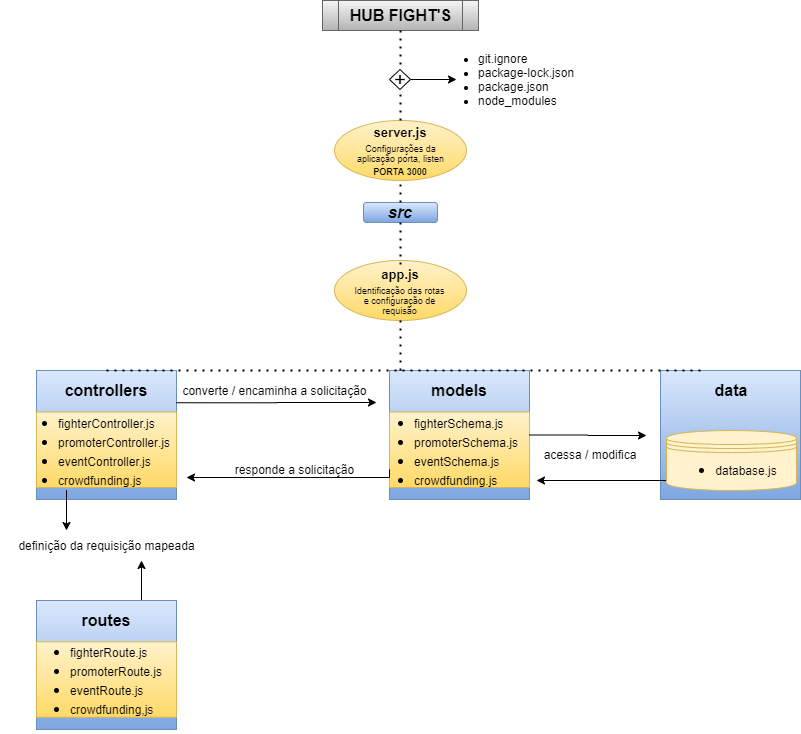
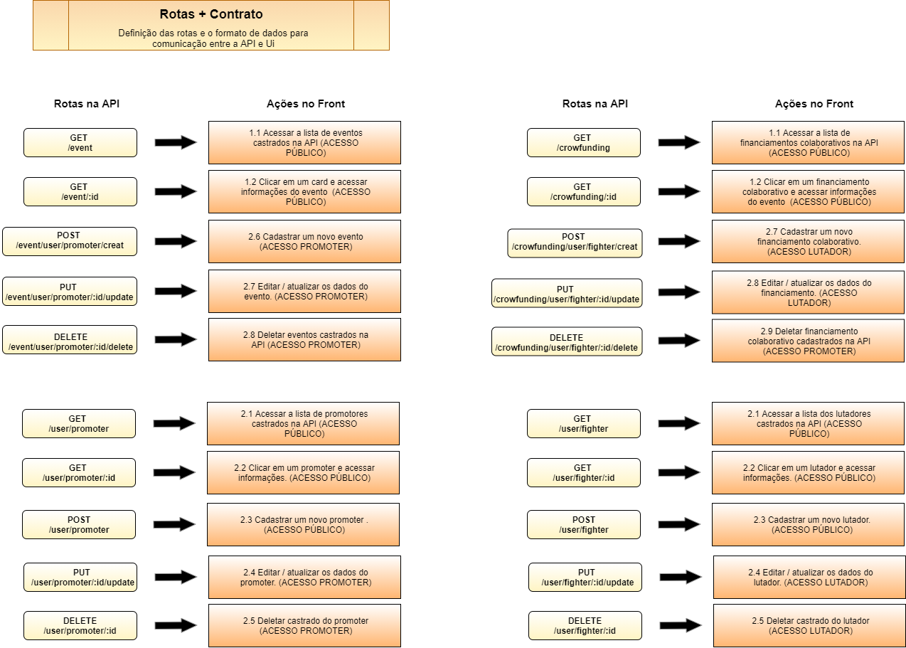

# API PLATAFORMA HUB FIGHT'S
## Descrição
Projeto de conclusão do curso - Desenvolvimento Back-end da [{Reprograma}](https://reprograma.com.br/). 

### Proposta do projeto final 
Construção de uma API de tema livre, capaz e executar um CRUD, as quatro operações básicas usadas em Banco de Dados Relacionais - Create (Criação), Read (Consulta), Update (Atualização) e Delete (Destruição), em um banco de dados NoSQL com realização do deploy desse projeto no Heroku. 

## Finalidade da API Hub Fight's
>Durante a minha trajetória profissional tive a oportunidade de trabalhar na área de eventos de MMA, como manager de atletas profissionais e fazendo parte da equipe de um dos maiores eventos do norte e nordeste do Brasil. 
>Conforme vivência no mundo esportivo, percebi a falta e a necessidade de uma plataforma com informações, oportunidades e conexão dos eventos mundiais com lutadores.
>
>Existem muitos talentos no Brasil e os eventos de todo o mundo procuram por atletas brasileiros. 
Como problemática do cenário atual nem todos os atletas têm acesso a esses eventos e condições financeiras para custear o campeonato.
>
>O esporte no brasil é ferramenta de inclusão social, com a plataforma será possivél aumentar as oportunidades para os atletas não desistirem de seus sonhos e incentivarem as crianças e jovens das suas comunidades.

### Solução da Hub Fight's
>Objetivos: 
>- Visilibdade para os atletas profissionais
>- Fortalecimento no mercado para os eventos nacionais 
>- Conexão global entre eventos e atletas profissionais 
>- Ambiente oficial para atletas de financiamento colaborativo.

>Desta forma crio a API da primeira plataforma marketplace voltada para o esporte de Artes Marciais >- Conectando a nível global, Promotores de Eventos, Atletas de MMA e Apoiadores de Financiamento Colaborativo.

## Tecnologias utilizadas

Para a consturição do projeto, as seguintes tecnologiasforam utilizadas:

- [JavaScript](https://www.javascript.com/) - Linguagem de programação
- [Node.js](https://nodejs.org/en/) - Ambiente de execução
- [Git/Github](https://github.com/) - Plataforma de hospedagem do código fonte
- [heroku](https://dashboard.heroku.com/apps) - Plataforma Cloud para deploy
- [MongoDB](https://www.mongodb.com/) - Banco de Dados NoSQL 
- [MongoDB Atlas](https://www.mongodb.com/cloud/atlas/) - Banco de Dados em nuvem
- [Express](https://expressjs.com/pt-br/) - Framework, gerenciador de requisções

Outras Ferramentas
- [Nodemon](https://nodemon.io/)
- [Mongoose](https://mongoosejs.com/)
- [Dotenv](https://www.npmjs.com/package/dotenv)
- [Cors](https://www.npmjs.com/package/cors)

## Arquitetura

        Arquitetura MVC
        |
        \--📂 **HUB-FIGHTS**
            | 📄 README.md
            | 📄 .env
            | 📄 .gitignore
            | 📄 package-lock.json
            | 📄 package.json
            | 📄 **server.js**  
            \--📂 node_modules
            \--📂 assets
            \--📂src
                | 📄**app.js**
                📂---data
                |   📄 **database.js
                📂---controllers
                |   📄 **crowdfundingController.js
                |   📄  eventController.js
                |   📄  fighterController.js
                |   📄  promoterController.js**
                📂---models
                |   📄  **crowdfundingSchema.js
                |   📄  eventoSchema.js
                |   📄  fighterSchema.js
                |   📄  promoterSchema.js**
                📂---routes
                |   📄  **crowdfundingoutes.js
                |   📄  eventRoutes.js
                |   📄  fighterRoutes.js
                |   📄  promoterRoutes.js**
                |__ 📄  index.js**

## Fluxo do consumo da API

## Rotas + Contrato
Essa API deve ter as seguintes rotas:

#### Links

* local: http://localhost:5555
* Heroku: https://hub-fights.herokuapp.com/

## Modelo com campos obrigatórios para teste

### Atleta

    {
        "fighterName": "Vanessa Campos",
        "genre": "F",
        "sherdogLink": "www.sherdog.com.br/van",
        "emailAddress": "van@gmail.com",
        "passoword": "senha",
        "phoneNumber": "71966825469"
        }

#### Promotor

    {
        "promoterName": "Hugo Houj",
        "emailAddress": "hugo@gmail.com",
        "passoword": "senha",
        "phoneNumber": "71966666825469"
        }

### Evento

    {
        "eventName": "Numberr Fight",
        "eventData": "10/10/2021",
        "opportunityFight": "Vagas: Categoria 70kg Masculino,  Categoria 64kg Feminino",
        "id_promoter": "5fd222317ab4181c88b6d425"
        }

### Financiamento Colaborativo

    {
        "id_fighter": "5fd2220e7ab4181c88b6d424",
        "fightertName": "Venssa Campos",
        "crowdfundingData": "10/10/2021",
        "title": "Evento valendo cinturão em Vegas",
        "descriptions": "Tenho 25 anos, estou em busca dos meus sonhos. Recebi o convite para lutar em Vegas e não tenho como comprar a passagem aérea.",
        "valueTotal": "4.320,00"
        }

## ✅Nota importante
>Gratidão a toda equipe da Reprograma, por esse projeto incrível, a empresa parceira XP inc. que viabilizou que esse bootcamp transformace a vida de tantas mulheres e que assim pudessemos voltar a ocupar nosso espaço na tecnologia. 
>
>Nessas linhas de código deixo a revolução, em pequenas atitudes promovo grandes transformações! 

### { Code como uma mulher } 
### Tassila Bomfim
[Linkedin](https://www.linkedin.com/in/tassilabomfim/)

